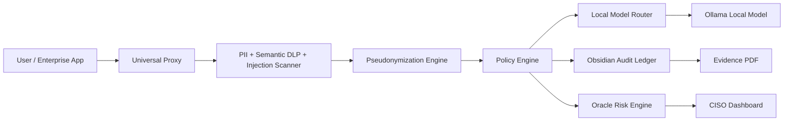

# Sentinel Shield Documentation

## Product Identity

**Product:** Sentinel Shield  
**Company:** Xavira Tech Labs  
**Purpose:** Sovereign AI security gateway for private local AI, PII masking, policy enforcement, risk scoring, and audit evidence.

Sentinel Shield is designed for buyers who want an enterprise AI assistant without sending sensitive data directly to external LLM providers.

## Executive Summary

Sentinel Shield sits between users and AI systems. Every prompt is inspected before inference. Sensitive identifiers are pseudonymized, prompt-injection attempts are blocked, semantic risks are scored, and every decision is written to a tamper-evident ledger.

The dashboard at `http://localhost:3000` gives a buyer one place to verify:

- Vault AI local assistant
- Raw vs masked proxy output
- Oracle risk heatmap
- Audit chain status
- Evidence PDF generation
- Policy and compliance status

## Architecture



## Runtime Services

| Service | Port | Purpose |
| --- | --- | --- |
| Frontend dashboard | `3000` | Buyer/CISO UI |
| FastAPI gateway | `8000` | Security gateway and API |
| Ollama | `11434` | Local model runtime |
| Redis | `6379` | Risk/cache runtime |
| PostgreSQL | `5432` | Cloud-mode database |

## Security Controls

| Control | Status | Evidence |
| --- | --- | --- |
| Fail-closed secrets | Active | `backend/config.py` |
| First-run admin generator | Active | `backend/db/session.py` |
| Forced password rotation | Active | `/api/v2/auth/change-password` |
| Closed registration by default | Active | `ENABLE_SELF_REGISTRATION=false` |
| Disabled-user token rejection | Active | `get_active_user` dependency |
| JWT revocation hook | Active | `/api/v2/auth/logout` |
| Redis revocation store | Active | `REDIS_URL`, memory fallback |
| Admin user management | Active | `/api/v2/admin/users` |
| Dynamic CORS allowlist | Active | `ALLOWED_ORIGINS` |
| Oversized request blocking | Active | `API_SHIELD_MAX_BODY_BYTES` |
| Suspicious path blocking | Active | `API_SHIELD_BLOCKED_PATH_FRAGMENTS` |
| Security response headers | Active | `ZeroTrustAPIShieldMiddleware` |
| Local-first model routing | Active | `backend/gateway/model_router.py` |
| India PII patterns | Active | `backend/compliance/india_patterns.py` |
| Dynamic pseudonymization | Active | `backend/redaction_middleware.py` |
| Prompt injection detection | Active | `backend/prompt_injection.py` |
| Semantic DLP | Active | `backend/semantic_dlp.py` |
| User risk scoring | Active | `backend/risk_engine.py` |
| Tamper-evident ledger | Active | `backend/audit/ledger.py` |
| Evidence PDF | Active | `backend/reporting/evidence_report.py` |
| Model Management Center | Active | `/api/v2/enterprise/models` |
| Evidence Report History | Active | `/api/v2/enterprise/reports` |
| CISO Alert Center | Active | `/api/v2/enterprise/alerts` |
| Quarantine Management | Active | `/api/v2/enterprise/quarantine` |
| Global Policy Sync Signatures | Active | `/api/v2/enterprise/policy-bundles/sign` |
| LLM Firewall Builder | Active | `/api/v2/enterprise/firewall/rules` |
| mTLS Deployment Wizard | Active | `/api/v2/enterprise/mtls/nginx` |
| Tenant Branding Pack | Active | `/api/v2/enterprise/branding` |
| Off-Box Ledger Anchoring | Active | `/api/v2/enterprise/ledger/anchor` |
| Release Metadata | Active | `/api/v2/enterprise/version` |
| SIEM Alert Export | Active | `/api/v2/enterprise/alerts/export` |
| Safe Model Pull Job | Disabled by default | `ENABLE_MODEL_PULL=false` |

## Security Disclosure

The final production lockdown healed the five blockers identified during readiness review:

1. **Hardcoded JWT fallback secret — HEALED**  
   `JWT_SECRET_KEY` is mandatory. Missing, short, or placeholder values stop boot.

2. **Hardcoded license master secret — HEALED**  
   `LICENSE_MASTER_SECRET` is mandatory in license server and validator paths.

3. **Wildcard CORS policy — HEALED**  
   `ALLOWED_ORIGINS` is configurable and rejects wildcard `*`.

4. **Demo admin credentials — HEALED**  
   Demo credentials were removed. First boot creates a random temporary Super Admin password.

5. **Unsealed actor and ledger salts — HEALED**  
   `ACTOR_HASH_SALT` and `LEDGER_MASTER_SALT` are mandatory and rotated by the production seal.

6. **Open self-registration risk — HEALED**  
   `/api/v2/auth/register` is closed unless `ENABLE_SELF_REGISTRATION=true`. Optional invite-token gating is available through `REGISTRATION_INVITE_TOKEN`.

7. **Stale token risk after account disablement — HEALED**  
   Protected routes verify that the token subject still maps to an active user before executing privileged actions.

8. **API abuse and reconnaissance noise — HEALED**  
   The Zero-Trust API Shield blocks oversized protected requests, suspicious probe paths, repeated protected calls, and applies browser hardening headers.

## First-Run Admin Flow

1. Start the backend.
2. If no `SUPER_ADMIN` exists, the backend prints:

```text
Admin email: admin@sentinel.local
Temporary password: <generated-password>
```

3. Login on `http://localhost:3000`.
4. Change the temporary password before using protected features.

## Production Seal

Command:

```bash
pnpm production:seal
```

The script performs:

- Runtime evidence scrub
- Secret rotation
- Actor salt generation
- Ledger salt generation
- Isolated test environment creation
- Full test execution
- Git staging
- Final production seal commit

Expected final output:

```text
47 passed
chore: enterprise production seal applied
```

## Submission Checklist

Do not submit or demo until every item is green:

```bash
python3 -m compileall backend tests
.runtime_venv/bin/python -m pytest
cd frontend && pnpm lint
cd frontend && pnpm build
curl http://localhost:8000/health
curl http://localhost:8000/
pnpm smoke:e2e
```

Expected:

- Backend compile passes
- Frontend lint has no errors
- Frontend production build passes
- API health returns `awake`
- API root shows `BY XAVIRA TECH LABS`
- Dashboard loads at `http://localhost:3000`
- No Next/Vercel starter logos are visible
- Vault AI model dropdown only shows local models
- Enterprise Center loads model/report/alert/quarantine widgets
- Self-registration is disabled unless deliberately enabled
- Protected API responses include `X-Frame-Options: DENY`
- Users tab loads live users from `/api/v2/admin/users`
- Password reset returns a one-time temporary password and forces rotation
- `/api/v2/risk/heatmap` responds after login
- `/api/v2/audit/report` can generate an evidence report

## Buyer Demo Script

1. Open `http://localhost:3000`.
2. Login with first-run admin credentials.
3. Change the temporary password.
4. Open **Proxy** tab.
5. Paste:

```text
Patient Aadhaar 2345 6789 0123 and PAN ABCDE1234F needs help drafting an insurance appeal.
```

6. Confirm the **Before** panel shows raw text.
7. Confirm the **After** panel shows pseudonym tokens.
8. Open **Vault AI**.
9. Ask a normal broad question to prove local assistant behavior.
10. Open **Oracle Risk**.
11. Confirm diagnostics and risk cards.
12. Open **Audit Log**.
13. Generate **Evidence** PDF.

## Troubleshooting

### `localhost:8000 refused to connect`

Start backend:

```bash
set -a; source .env; set +a
.runtime_venv/bin/uvicorn backend.app:app --host 127.0.0.1 --port 8000
```

### Frontend not loading

Start frontend:

```bash
cd frontend
pnpm dev
```

### Vault AI not answering

Check Ollama:

```bash
ollama list
curl http://localhost:11434/api/tags
```

Pull the local model:

```bash
ollama pull llama3.1
```

### Registration blocked

That is the secure default. To temporarily allow controlled onboarding:

```bash
ENABLE_SELF_REGISTRATION=true
REGISTRATION_INVITE_TOKEN=<one-time-shared-token>
```

Pass the invite token before the department value in the registration department field:

```text
<one-time-shared-token>:SECURITY
```

### Full authenticated smoke proof

Run after changing the first-run admin password:

```bash
SENTINEL_SMOKE_EMAIL=admin@sentinel.local \
SENTINEL_SMOKE_PASSWORD='<changed-password>' \
pnpm smoke:e2e
```

This verifies login, diagnostics, proxy masking, risk heatmap, and audit ledger access.

### Backend refuses to boot

Check `.env` contains strong values for:

```text
JWT_SECRET_KEY
LICENSE_MASTER_SECRET
ACTOR_HASH_SALT
LEDGER_MASTER_SALT
```

Run:

```bash
pnpm production:seal
```

## Next-Level Implementation Suggestions

The first wave of enterprise upgrades is now implemented:

1. **Model management page**: `/api/v2/enterprise/models` and the dashboard Enterprise tab show local Ollama inventory and gateway status.
2. **Signed policy sync**: `/api/v2/enterprise/policy-bundles/sign` creates rollout manifests and `/verify` detects tampering before edge deployment.
3. **Evidence report history**: `/api/v2/enterprise/reports` lists generated reports with SHA-256 certificates and authenticated downloads.
4. **mTLS deployment guide**: `/api/v2/enterprise/mtls/nginx` generates a buyer-specific Nginx mTLS template.
5. **Browser/API smoke proof**: `pnpm smoke:e2e` and `pnpm browser:e2e` provide repeatable handoff verification.
6. **Ledger anchoring**: `/api/v2/enterprise/ledger/anchor` creates signed local anchor records for Object Lock, private Git, or SIEM handoff.
7. **Production readiness scoring**: `/api/v2/enterprise/readiness` proves secrets, CORS, ledger, policy, scanner, and model posture.
8. **Evidence backup bundle**: `/api/v2/enterprise/backup` creates a non-secret signed ZIP of audit and due-diligence artifacts.
9. **Restore drill**: `/api/v2/enterprise/restore-drill` validates the newest evidence backup and ledger chain without modifying state.
10. **Threat model generator**: `/api/v2/enterprise/threat-model` produces a deployment-specific attack surface checklist and certificate.

Recommended second wave:

1. **Streaming Vault AI responses**: `/api/v2/chat/stream` now exposes server-sent events for token-style local AI output.
2. **Admin MFA**: `/api/v2/auth/mfa/setup`, `/enable`, and `/verify` provide standards-based TOTP without cloud dependencies.
3. **Enterprise API keys**: `/api/v2/admin/api-keys` supports scoped app keys for CRM, Slack, Teams, and custom proxy clients.
4. **Policy simulator**: `/api/v2/policy/simulate` dry-runs redaction, semantic DLP, injection detection, and routing decisions.
5. **CISO incident timeline**: `/api/v2/enterprise/incidents/{actor_hash}` returns actor-specific evidence with a certificate.
6. **Evidence scheduler**: `/api/v2/enterprise/evidence-schedule` stores weekly/monthly report schedules for air-gapped cron runners.
7. **Scheduled report runner**: `python scripts/generate_scheduled_evidence.py` generates configured compliance PDFs.

Remaining future-proof upgrades:

1. **Redis-backed risk engine**: move file-backed Oracle state to Redis for multi-node production.
2. **Off-box automatic ledger anchoring**: push daily roots to S3 Object Lock, Git, or a private timestamping service.
3. **Native dashboard controls**: expose the new MFA, API key, simulator, and schedule endpoints in the Enterprise tab.

## Final Handoff Position

Sentinel Shield is now positioned as a local-first, enterprise AI governance gateway branded by Xavira Tech Labs. The system is ready for controlled buyer demos after the submission checklist passes.
