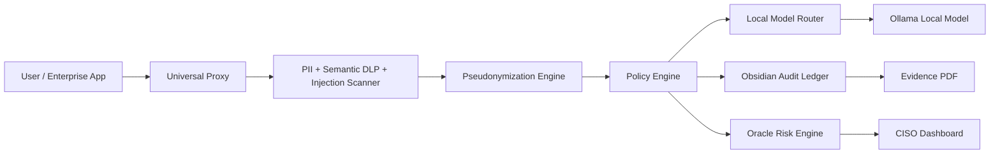

# Sentinel Shield Documentation

## Product Identity

**Product:** Sentinel Shield  
**Company:** Xavira Tech Labs  
**Purpose:** Sovereign AI security gateway for private local AI, PII masking, policy enforcement, risk scoring, and audit evidence.

Sentinel Shield is designed for buyers who want an enterprise AI assistant without sending sensitive data directly to external LLM providers.

## Executive Summary

Sentinel Shield sits between users and AI systems. Every prompt is inspected before inference. Sensitive identifiers are pseudonymized, prompt-injection attempts are blocked, semantic risks are scored, and every decision is written to a tamper-evident ledger.

The dashboard at `http://localhost:3000` gives a buyer one place to verify:

- Vault AI local assistant
- Raw vs masked proxy output
- Oracle risk heatmap
- Audit chain status
- Evidence PDF generation
- Policy and compliance status

## Architecture



## Runtime Services

| Service | Port | Purpose |
| --- | --- | --- |
| Frontend dashboard | `3000` | Buyer/CISO UI |
| FastAPI gateway | `8000` | Security gateway and API |
| Ollama | `11434` | Local model runtime |
| Redis | `6379` | Risk/cache runtime |
| PostgreSQL | `5432` | Cloud-mode database |

## Security Controls

| Control | Status | Evidence |
| --- | --- | --- |
| Fail-closed secrets | Active | `backend/config.py` |
| First-run admin generator | Active | `backend/db/session.py` |
| Forced password rotation | Active | `/api/v2/auth/change-password` |
| Dynamic CORS allowlist | Active | `ALLOWED_ORIGINS` |
| Local-first model routing | Active | `backend/gateway/model_router.py` |
| India PII patterns | Active | `backend/compliance/india_patterns.py` |
| Dynamic pseudonymization | Active | `backend/redaction_middleware.py` |
| Prompt injection detection | Active | `backend/prompt_injection.py` |
| Semantic DLP | Active | `backend/semantic_dlp.py` |
| User risk scoring | Active | `backend/risk_engine.py` |
| Tamper-evident ledger | Active | `backend/audit/ledger.py` |
| Evidence PDF | Active | `backend/reporting/evidence_report.py` |

## Security Disclosure

The final production lockdown healed the five blockers identified during readiness review:

1. **Hardcoded JWT fallback secret — HEALED**  
   `JWT_SECRET_KEY` is mandatory. Missing, short, or placeholder values stop boot.

2. **Hardcoded license master secret — HEALED**  
   `LICENSE_MASTER_SECRET` is mandatory in license server and validator paths.

3. **Wildcard CORS policy — HEALED**  
   `ALLOWED_ORIGINS` is configurable and rejects wildcard `*`.

4. **Demo admin credentials — HEALED**  
   Demo credentials were removed. First boot creates a random temporary Super Admin password.

5. **Unsealed actor and ledger salts — HEALED**  
   `ACTOR_HASH_SALT` and `LEDGER_MASTER_SALT` are mandatory and rotated by the production seal.

## First-Run Admin Flow

1. Start the backend.
2. If no `SUPER_ADMIN` exists, the backend prints:

```text
Admin email: admin@sentinel.local
Temporary password: <generated-password>
```

3. Login on `http://localhost:3000`.
4. Change the temporary password before using protected features.

## Production Seal

Command:

```bash
pnpm production:seal
```

The script performs:

- Runtime evidence scrub
- Secret rotation
- Actor salt generation
- Ledger salt generation
- Isolated test environment creation
- Full test execution
- Git staging
- Final production seal commit

Expected final output:

```text
47 passed
chore: enterprise production seal applied
```

## Submission Checklist

Do not submit or demo until every item is green:

```bash
python3 -m compileall backend tests
cd frontend && pnpm lint
cd frontend && pnpm build
curl http://localhost:8000/health
curl http://localhost:8000/
```

Expected:

- Backend compile passes
- Frontend lint has no errors
- Frontend production build passes
- API health returns `awake`
- API root shows `BY XAVIRA TECH LABS`
- Dashboard loads at `http://localhost:3000`
- No Next/Vercel starter logos are visible
- Vault AI model dropdown only shows local models
- `/api/v2/risk/heatmap` responds after login
- `/api/v2/audit/report` can generate an evidence report

## Buyer Demo Script

1. Open `http://localhost:3000`.
2. Login with first-run admin credentials.
3. Change the temporary password.
4. Open **Proxy** tab.
5. Paste:

```text
Patient Aadhaar 2345 6789 0123 and PAN ABCDE1234F needs help drafting an insurance appeal.
```

6. Confirm the **Before** panel shows raw text.
7. Confirm the **After** panel shows pseudonym tokens.
8. Open **Vault AI**.
9. Ask a normal broad question to prove local assistant behavior.
10. Open **Oracle Risk**.
11. Confirm diagnostics and risk cards.
12. Open **Audit Log**.
13. Generate **Evidence** PDF.

## Troubleshooting

### `localhost:8000 refused to connect`

Start backend:

```bash
set -a; source .env; set +a
.runtime_venv/bin/uvicorn backend.app:app --host 127.0.0.1 --port 8000
```

### Frontend not loading

Start frontend:

```bash
cd frontend
pnpm dev
```

### Vault AI not answering

Check Ollama:

```bash
ollama list
curl http://localhost:11434/api/tags
```

Pull the local model:

```bash
ollama pull llama3.1
```

### Backend refuses to boot

Check `.env` contains strong values for:

```text
JWT_SECRET_KEY
LICENSE_MASTER_SECRET
ACTOR_HASH_SALT
LEDGER_MASTER_SALT
```

Run:

```bash
pnpm production:seal
```

## Next-Level Implementation Suggestions

These are the highest-impact upgrades before a serious enterprise sale:

1. **Streaming Vault AI responses**  
   Add server-sent events or WebSocket streaming so local AI feels fast and premium.

2. **Password-change UI**  
   The backend supports forced password change. Add a polished frontend screen for it.

3. **Admin user management backed by API**  
   Replace static user table mock data with real CRUD endpoints and RBAC controls.

4. **Redis-backed risk engine**  
   Current risk state is file-backed for localhost. Use Redis in production for distributed edge nodes.

5. **Policy sync hub**  
   Add signed remote policy bundles with version pinning, rollback, and tenant scope.

6. **Model management page**  
   Show installed Ollama models, pull status, default model, memory footprint, and health.

7. **Evidence report download button**  
   The backend generates reports. Add direct browser download and report history.

8. **mTLS deployment guide**  
   Document Envoy/Nginx mTLS termination and required forwarded certificate headers.

9. **End-to-end Playwright smoke suite**  
   Automate login, proxy masking, Vault AI query, risk heatmap, and evidence generation.

10. **Immutable off-box ledger export**  
   Push daily ledger roots to S3 Object Lock, Git, or a private timestamping service.

## Final Handoff Position

Sentinel Shield is now positioned as a local-first, enterprise AI governance gateway branded by Xavira Tech Labs. The system is ready for controlled buyer demos after the submission checklist passes.
