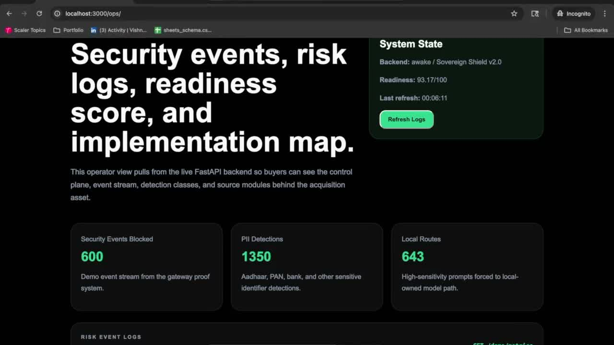
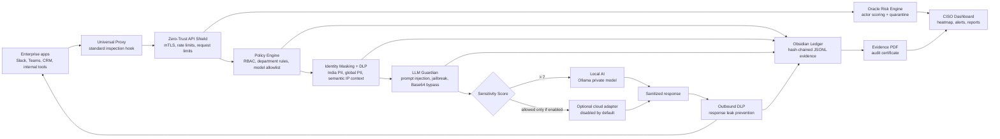
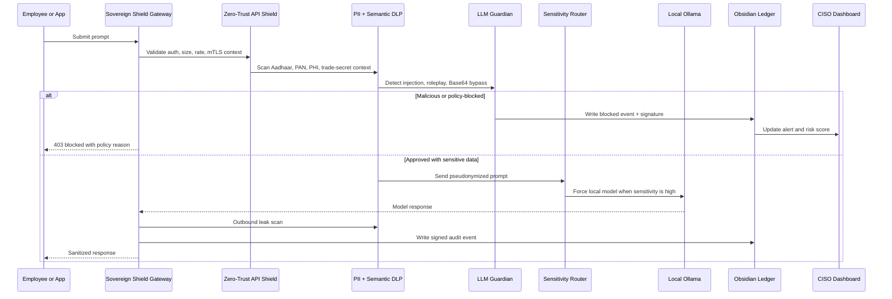
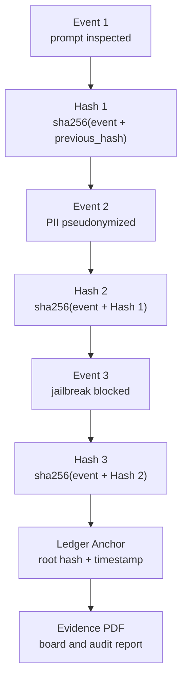
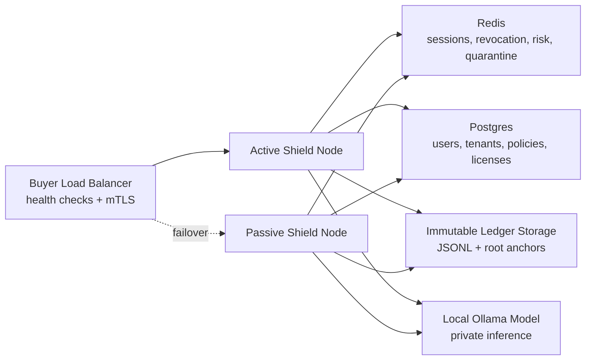
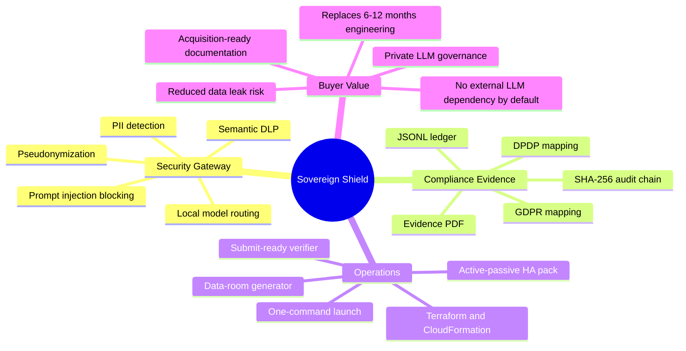

# Sovereign Shield

[](https://github.com/vishnuvardhanburri/Sovereign-Shield/actions/workflows/ci.yml)

> **Enterprise Acquisition Ready — Verified Build**
> Includes: Security Hardening, Compliance Mapping, Data Room, Deployment Pack

**Sovereign Shield by Xavira Tech Labs** is an **Enterprise AI Security Gateway for Private LLM Deployments**. It helps regulated teams adopt local AI while protecting PII, enforcing DPDP/GDPR controls, and generating audit evidence from one localhost control plane.

**Production-ready AI security infrastructure with full compliance, audit, and deployment stack—replacing 9–12 months of engineering.**

## Enterprise Demo Video

[](docs/demo/sovereign-shield-enterprise-demo.mp4)

[Watch the demo video](docs/demo/sovereign-shield-enterprise-demo.mp4) or open the [GitHub demo page](docs/demo/README.md).

The system is designed to run without external LLM API keys. Vault AI uses the buyer's own local Ollama model by default.

Default deployment posture:

```text
DEPLOYMENT_MODE=airgap
CLOUD_ADAPTERS_ENABLED=false
DATABASE_URL=<buyer-owned database>
```

No OpenRouter, OpenAI, Anthropic, Gemini, or other third-party LLM key is required.

## High-Conversion Hook

Secure private LLM adoption without leaking PII to external APIs.
Mask regulated data, block prompt injection, and route sensitive prompts to local models.
Generate audit-ready DPDP/GDPR evidence from every AI request.

## What It Does

| Layer | Capability |
| --- | --- |
| Vault AI | Private local AI assistant powered by Ollama |
| Identity Masking Proxy | Pseudonymizes sensitive values before model inference |
| India PII Scanner | Detects Aadhaar, PAN, IFSC, UPI, GST, UHID, ABHA, phone, bank and other DPDP categories |
| Prompt Injection Shield | Blocks jailbreaks, instruction override attempts, and prompt leakage requests |
| Hallucination & Jailbreak Guardian | Locally validates adversarial intent, Base64 bypasses, roleplay attacks, and suffix/token smuggling |
| Semantic DLP | Detects sensitive business context such as trade secrets and M&A discussion |
| Obsidian Ledger | Tamper-evident JSONL audit chain with salted signatures |
| Oracle Risk Engine | Scores actors, tracks repeated PII attempts, and auto-quarantines risky users |
| Evidence Reports | Generates PDF evidence for CISO, board, and DPDP/GDPR review |
| Universal Proxy | Standard inspection API for Slack, Teams, CRM, and custom enterprise apps |
| Admin Console | Live user creation, disablement, forced reset, and RBAC visibility |
| Enterprise Center | Model inventory, CISO alerts, report history, policy bundles, mTLS config, branding, firewall rules, and ledger anchoring |
| Active-Passive HA Pack | Redis/Postgres state sync, failover runbook, Terraform, and CloudFormation for buyer-owned private cloud |

## Enterprise Architecture

### Control Plane



### Secure Request Pipeline



### Tamper-Evident Evidence Chain



### Active-Passive HA Topology



### Buyer Diligence Mindmap



## Local URLs

```text
Dashboard: http://localhost:3000
API:       http://localhost:8000
Docs:      http://localhost:8000/api/docs
Health:    http://localhost:8000/health
```

## Buyer-Facing Folder Map

```text
/code      Hardened source map for backend, frontend, scripts, and tests
/docs      Compliance mapping, threat model, system snapshot, listing copy, buyer replies
/evidence  100/100 buyer verification and SHA-256 evidence certificate
```

## One-Command Start

For a simple buyer demo or submission check:

```bash
pnpm launch
```

For full end-to-end readiness proof:

```bash
pnpm submit:ready
```

`submit:ready` prints live progress and writes a verification JSON under `logs/verification/`.
The local Next.js production build is reported as optional because GitHub Actions remains
the authoritative production build gate.

See `START_HERE.md` for the non-technical handoff flow.

## Acquisition / Buyer Commands

```bash
pnpm deploy:enterprise    # Start services, print URLs, validate local health
pnpm demo:narrative       # Print the $500K acquisition video flow
pnpm demo:investor        # Seed synthetic security activity and open dashboard
pnpm generate:data-room   # Produce architecture, compliance, API, screenshots, and ZIP
pnpm submit:ready         # End-to-end buyer verification
```

## Monetization Signal

Pricing page:

```text
http://localhost:3000/pricing
```

Buyer demo page:

```text
http://localhost:3000/demo
```

Plans:

- Starter: `$499/mo`
- Growth: `$999/mo`
- Enterprise: `Custom`

Annual positioning:

- Starter: `$4,990/year`
- Growth: `$9,990/year`
- Enterprise: `Custom annual contract`

License validation signal:

```text
POST /api/v1/license/validate
```

## Simulated Demo Proof

```text
GET /demo/metrics
GET /demo/tier3-self-healing
```

The demo metrics endpoint returns clearly labeled synthetic enterprise activity for buyer evaluation. It does not claim customer traction or production usage.

The Tier 3 endpoint proves the self-healing security layer: jailbreak guardian, semantic IP DLP, active-passive HA packaging, and golden-image IaC readiness.

## First Login

Production builds do not ship demo credentials.

On first boot, if no Super Admin exists, the backend generates a random temporary password in the backend logs.

Default first-run admin email:

```text
admin@sovereign.local
```

The account is marked `force_password_change: true`. Protected features stay blocked until the password is changed through:

```text
POST /api/v2/auth/change-password
```

The dashboard automatically shows a password-rotation screen when this flag is present.

## Required Environment

The backend refuses to boot if these values are missing, short, or placeholders:

```text
JWT_SECRET_KEY
LICENSE_MASTER_SECRET
ACTOR_HASH_SALT
LEDGER_MASTER_SALT
ALLOWED_ORIGINS
```

For buyer deployments, the only required infrastructure dependency is the database. The AI path is local by default through Ollama; cloud LLM adapters stay disabled unless a buyer deliberately opts in with `CLOUD_ADAPTERS_ENABLED=true`.

Generate secure values with:

```bash
pnpm production:seal
```

For production deployments, start from `.env.example.production`.

## Run The Full Stack

```bash
pnpm dev:full
```

This launches:

- FastAPI security gateway
- CISO dashboard
- Redis risk tracker
- PostgreSQL
- Ollama local model service

For manual local development:

```bash
# Backend
set -a; source .env; set +a
.runtime_venv/bin/uvicorn backend.app:app --host 127.0.0.1 --port 8000

# Frontend
cd frontend
pnpm dev
```

## Production Seal

```bash
pnpm production:seal
```

The seal script:

- Rotates JWT, license, actor-hash, and ledger salts
- Scrubs runtime logs and local evidence
- Creates an isolated Python test environment
- Installs test dependencies
- Runs the full test suite
- Stages all changes
- Commits the sealed state with:

```text
chore: enterprise production seal applied
```

## Verification Checklist

Before showing or submitting the product, run:

```bash
python3 -m compileall backend tests
.runtime_venv/bin/python -m pytest
cd frontend && pnpm lint && pnpm build
curl http://localhost:8000/health
pnpm smoke:e2e
pnpm browser:e2e
pnpm release:certificate
pnpm handoff:zip
```

Expected:

```text
Backend compile: pass
Frontend lint: 0 errors
Frontend build: pass
Health: {"status":"awake","engine":"Sovereign Shield v2.0"}
Smoke: security headers and probe blocking pass
```

Authenticated smoke proof:

```bash
SENTINEL_SMOKE_EMAIL=admin@sovereign.local \
SENTINEL_SMOKE_PASSWORD='<changed-password>' \
pnpm smoke:e2e
```

## Buyer Handoff Commands

```bash
pnpm demo:buyer              # Seed safe synthetic demo evidence and print local URLs
pnpm verify:buyer            # Run buyer-grade end-to-end verification
pnpm deployment:doctor       # Check ports, env, Ollama, Docker, and deployment artifacts
pnpm deployment:pack         # Generate Nginx, systemd, firewall, and production checklist
pnpm security:due-diligence  # Generate SBOM and dependency scan artifacts
pnpm release:certificate     # Generate signed readiness certificate JSON
pnpm handoff:pdf             # Generate architecture handoff PDF
pnpm handoff:zip             # Package docs, certificates, PDF, and deployment pack
pnpm screenshots:capture     # Capture dashboard screenshots when Playwright is installed
```

## Key API Endpoints

| Method | Endpoint | Purpose |
| --- | --- | --- |
| `POST` | `/api/v2/auth/login` | Login and receive JWT |
| `POST` | `/api/v2/auth/logout` | Revoke current JWT session |
| `POST` | `/api/v2/auth/change-password` | Change first-run temporary password |
| `GET` | `/api/v2/admin/users` | List users visible to the current role |
| `POST` | `/api/v2/admin/users` | Create a user with a temporary password |
| `PATCH` | `/api/v2/admin/users/{id}` | Update role, department, or active state |
| `POST` | `/api/v2/admin/users/{id}/reset-password` | Force reset and password rotation |
| `GET` | `/api/v2/system/diagnostics` | Self-diagnostic bootstrap status |
| `POST` | `/ask` | Governed Vault AI query |
| `POST` | `/api/v2/proxy/inspect` | Raw-vs-masked universal proxy preview |
| `GET` | `/api/v2/risk/heatmap` | Oracle user/API-key risk heatmap |
| `GET` | `/api/v2/enterprise/models` | Local model management inventory |
| `GET` | `/api/v2/enterprise/reports` | Evidence report download history |
| `GET` | `/api/v2/enterprise/alerts` | CISO alert center |
| `GET` | `/api/v2/enterprise/quarantine` | Quarantine management |
| `POST` | `/api/v2/enterprise/policy-bundles/sign` | Signed policy sync manifest |
| `POST` | `/api/v2/enterprise/firewall/rules` | LLM firewall YAML builder |
| `POST` | `/api/v2/enterprise/mtls/nginx` | mTLS Nginx config wizard |
| `POST` | `/api/v2/enterprise/branding` | Tenant branding pack |
| `POST` | `/api/v2/enterprise/ledger/anchor` | Off-box ledger root anchor |
| `GET` | `/api/v2/enterprise/version` | Release, commit, mode, and seal state |
| `POST` | `/api/v2/enterprise/models/pull` | Disabled-by-default Ollama pull job |
| `POST` | `/api/v2/enterprise/alerts/export` | Export CISO alerts to SIEM/webhook |
| `GET` | `/audit/log` | Obsidian ledger entries |
| `POST` | `/api/v2/audit/report` | CISO evidence PDF |
| `GET` | `/compliance/score` | Compliance scorecard |
| `POST` | `/policy/reload` | Reload local YAML policies |

## Security Guarantees

- Local-first AI routing through Ollama
- Fail-closed secrets
- No wildcard CORS
- No hardcoded demo admin password
- Closed-by-default self-registration
- Active-user enforcement on protected JWT routes
- Redis-backed JWT session revocation with memory fallback
- Oversized request, suspicious path, rate, and cost-budget controls
- Pseudonymization before inference
- Prompt injection detection before model routing
- Salted tamper-evident ledger signatures
- Actor risk scoring and quarantine
- Board-ready PDF evidence generation

## Known Production Assumptions

- Ollama must be installed and the configured local model must be pulled.
- mTLS requires a trusted Nginx or Envoy layer forwarding verified client-certificate headers.
- Redis is optional for localhost demos, but recommended for distributed risk/quarantine state.
- Off-box ledger anchoring should point to buyer-controlled immutable storage such as S3 Object Lock, private Git, or SIEM.
- Buyer-owned backup encryption requires `BACKUP_ENCRYPTION_PASSPHRASE`.

## Xavira Tech Labs Branding

The product is branded as:

```text
Sovereign Shield by Xavira Tech Labs
```

No starter framework logos or external model branding are used in the buyer-facing UI.

## License

Proprietary — Xavira Tech Labs © 2026. All rights reserved.

## Operational Documents

- `DOCS.md` — technical due diligence and operator guide
- `SECURITY.md` — security policy and vulnerability reporting
- `RELEASE.md` — release and buyer handoff checklist
- `SUBMISSION_CHECKLIST.md` — demo/submission gate
- `RELEASE_NOTES_v2.1.md` — enterprise lockdown release notes
- `docs/API_INTEGRATION_EXAMPLES.md` — Python, Node, Slack/Teams integration examples
- `docs/HOMEPAGE_COPY.md` — acquisition-ready homepage copy and pitch narrative
- `docs/ACQUIRE_LISTING_COPY.md` — listing title, hook, full description, and buyer FAQ
- `docs/BUYER_REPLIES.md` — initial reply, data-room reply, negotiation scripts, and price strategy
- `docs/COMPLIANCE_MAPPING.md` — DPDP/GDPR implementation mapping
- `docs/RED_TEAM_TEST_PACK.md` — adversarial prompts and expected outcomes
- `docs/buyer_pitch_deck.html` — browser-ready buyer pitch deck
- `BUYER_FAQ.md`, `PRIVACY.md`, `DATA_PROCESSING.md`, `THREAT_MODEL.md` — procurement pack
