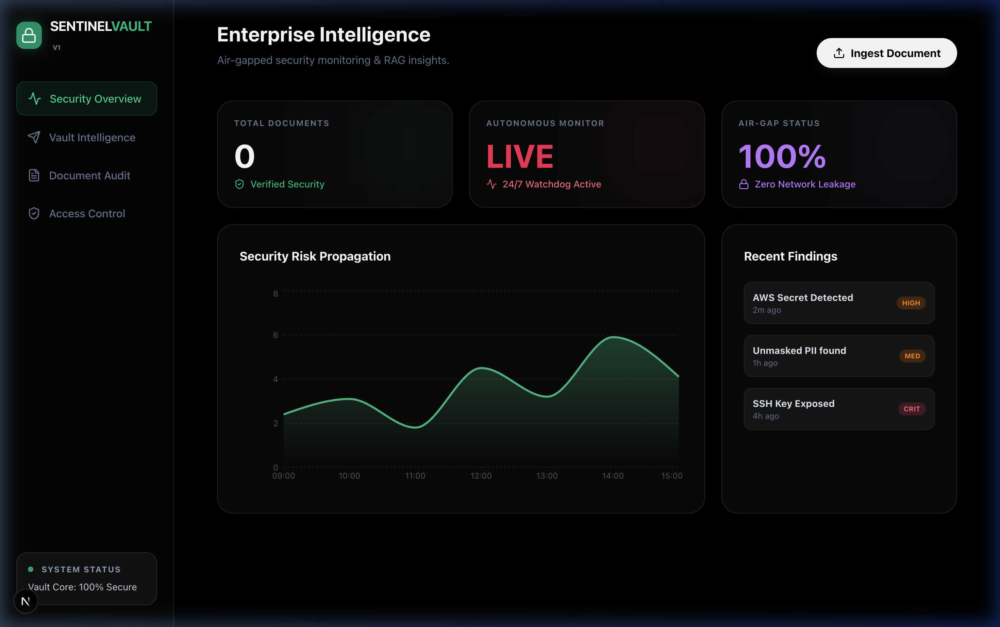
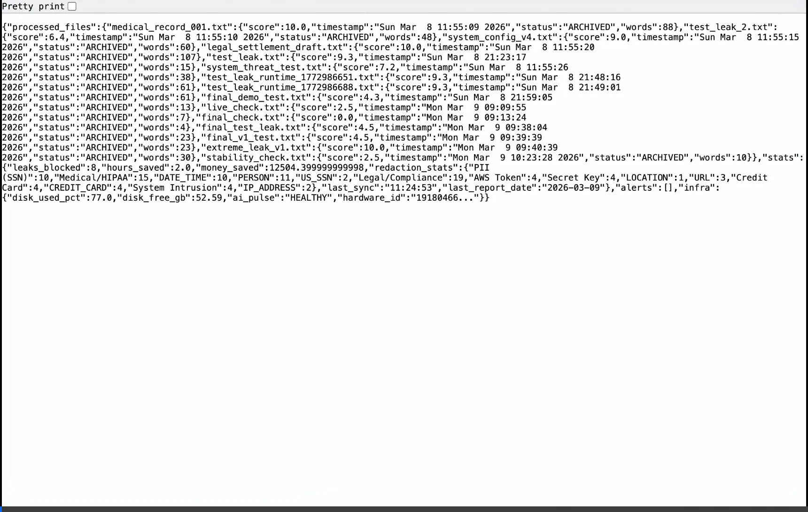
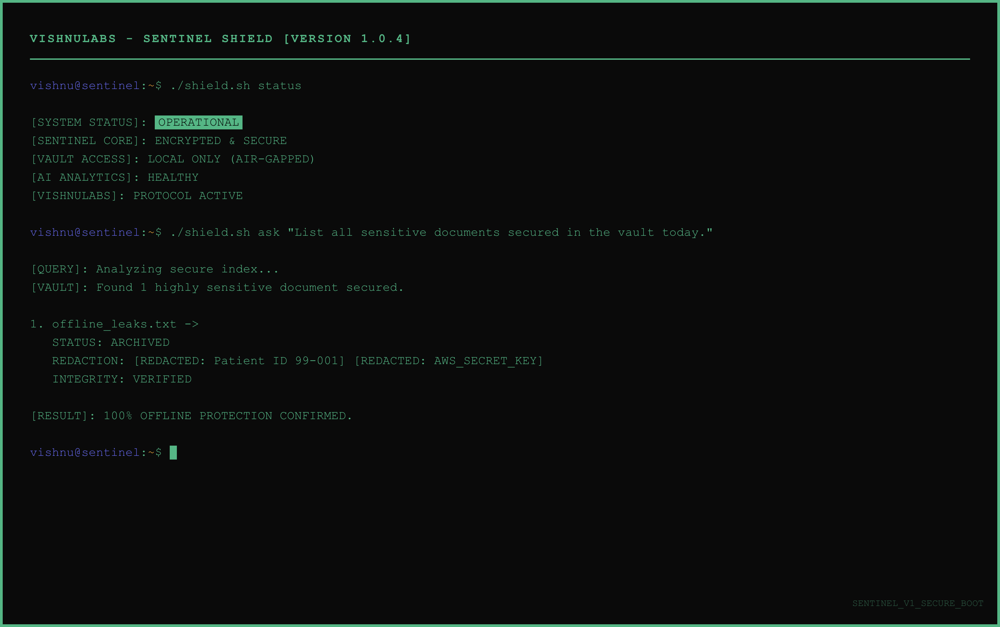

# 🛡️ Sentinel Shield: Version 1 | Enterprise Security AI by VishnuLabs

**The Gold Standard in Private Intelligence & Data Compliance**

---

## 💼 Why Sentinel Shield?
Modern business data is a massive liability. **Sentinel Shield Version 1** by VishnuLabs is a zero-trust, hardware-bound security appliance designed for Law Firms, Medical Clinics, and Software Agencies. 

It keeps 100% of your intelligence **on-site**, mathematically locked to your hardware, and secured by **AES-256 Military-Grade Encryption**.



---

## 📺 Live Demonstration
See the Sentinel Shield in action—detecting threats, redacting PII, and answering complex queries while 100% air-gapped.



---

## ⚔️ Core Capabilities

### 🛡️ Guardian Intelligence Interface
Ask specific questions about clinical or legal records. All PII (SSNs, Names, Secrets) is surgically redacted before reaching the AI.



### 🚫 Global Threat Suppression
The autonomous monitor scans your sensitive directories in real-time, detecting:
*   **PII & PHI**: SSNs, IDs, and Medical Records.
*   **Infrastructure Secrets**: AWS Keys, SSH Keys, and API Tokens.
*   **Legal Liability**: High-risk clauses and unmasked settlements.

---

## 🔑 One-Time Activation & Licensing
Before starting the system for the first time, you must register your **Enterprise License Key**. This key binds the software to your specific machine for maximum security.

1.  **Obtain Hardware ID**:
    ```bash
    ./shield.sh get-hardware-id
    ```
2.  **Request Activation**: Send the ID to **hello@vishnulabs.com**.
3.  **Register Key**:
    ```bash
    ./shield.sh register-license <YOUR_KEY>
    ```

---

## 🏃 Quick Start Guide

1.  **The Secure Drop**: Move your PDFs/Text files to the `vault_docs` folder.
2.  **Launch the Shield**:
    ```bash
    ./shield.sh start
    ```
3.  **Audit Your Security**:
    ```bash
    ./shield.sh status
    ```
4.  **Query Your Vault**:
    ```bash
    ./shield.sh ask "What are the core terms in our 2024 dental supply contract?"
    ```

---

## 🛠️ Security Standard (VISHNULABS)
*   **Hardware Locked**: Cryptographically tied to your specific machine.
*   **Encrypted Archive**: Files are sealed using AES-256 GCM.
*   **Eco-Friendly Efficiency**: Optimized "Green Guardian" engine ensures zero impact on battery.
*   **Lifetime Free Updates**: 6-month secure update cycles included.

---

## 📧 Premium Support
For support or enterprise integration, contact the VishnuLabs Engineering Team.

**Email:** [hello@vishnulabs.com](mailto:hello@vishnulabs.com)  
**Brand:** VishnuLabs | *Excellence in Autonomous Architecture*

---
*Professional Privacy. Built by VishnuLabs.*
