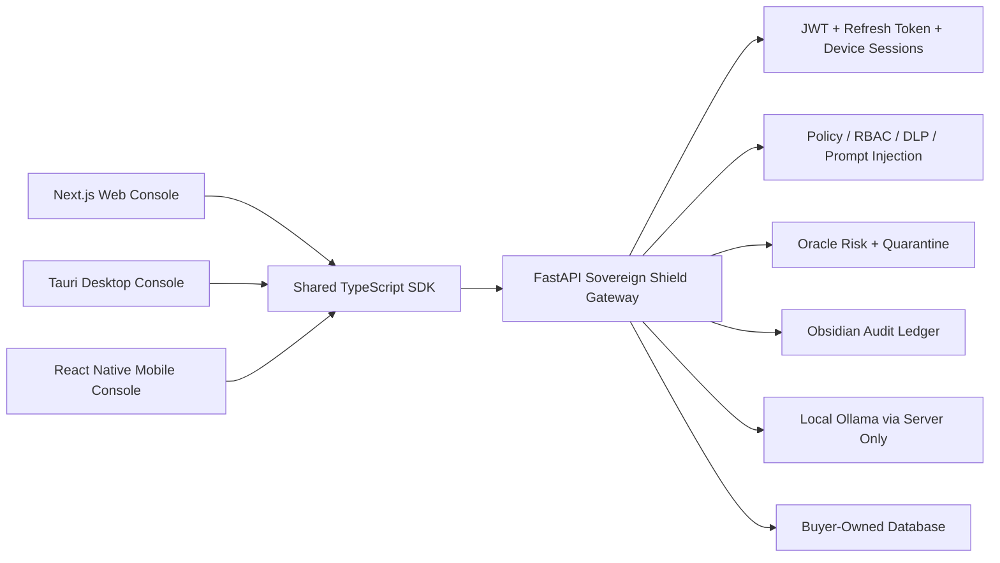
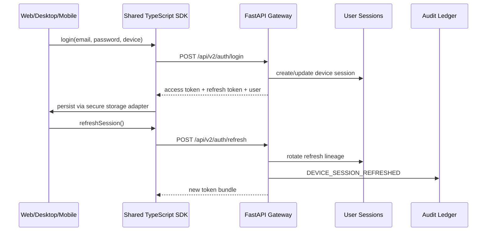

# Sovereign Shield Cross-Platform Architecture

Sovereign Shield is now structured as a backend-first enterprise product with secure operator consoles for web, desktop, and mobile. The FastAPI gateway remains the system of record; clients do not duplicate policy, DLP, routing, audit, license, or enforcement logic.

## Monorepo Structure

```text
backend/                 FastAPI security gateway and all enforcement logic
frontend/                Static buyer/demo dashboard used by current deployment path
apps/web/                Next.js operator dashboard shell
apps/desktop/            Tauri shell for macOS, Windows, and Linux
apps/mobile/             React Native / Expo shell for Android and iOS
packages/sdk/            Shared TypeScript API, auth, RBAC, and audit client
packages/design-system/  Shared tokens and UI state helpers
docs/cross-platform/     Release, security, and migration documentation
```

## Runtime Topology



## Client Responsibilities

Clients are operator consoles only:

- authenticate through `/api/v2/auth/login`
- rotate sessions through `/api/v2/auth/refresh`
- register device context with every login and refresh
- consume risk heatmaps, audit logs, evidence reports, and quarantine APIs
- store only session tokens and non-sensitive UI state in platform-secure storage
- never connect directly to Ollama, Redis, Postgres, or cloud LLM adapters

## Backend Responsibilities

All security decisions remain centralized:

- JWT validation and refresh-token rotation
- device session tracking and revocation
- RBAC authorization
- PII detection and pseudonymization
- prompt injection and jailbreak blocking
- semantic DLP
- sensitivity routing to local AI
- tamper-evident JSONL audit ledger
- evidence PDF generation
- license validation
- quarantine and emergency controls

## Authentication Flow



## Platform Consoles

| Surface | Stack | Purpose |
| --- | --- | --- |
| Web | Next.js | Primary CISO and security-operations dashboard |
| Desktop | Tauri | Native operator console with notifications, mTLS UI, exports, and ledger viewer |
| Mobile | React Native | Executive alerts, approvals, incident summaries, compliance preview |

## No Logic Duplication Rule

The clients may render data and collect operator intent, but they must not decide whether a prompt is safe, whether a user is quarantined, whether a model can be used, or whether evidence is valid. Those decisions are always server-owned and auditable.
